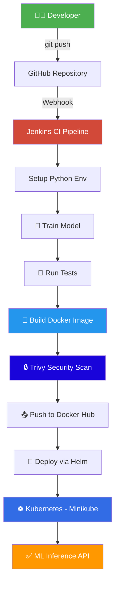

<p align="center">
  <h1 align="center">🚀 Zero-Touch ML</h1>
  <p align="center">
    <strong>CI/CD Pipeline for Automated Machine Learning Model Deployment</strong>
  </p>
  <p align="center">
    
    
    
    
    
    
    
  </p>
</p>

---

## 📖 Overview

**Zero-Touch ML** is a production-grade MLOps pipeline that automates the entire journey from `git push` to a live ML inference API running on Kubernetes — with **zero manual intervention**.

It demonstrates how trained machine learning models transition from development artifacts into scalable, containerized, security-scanned services deployed via Helm charts and orchestrated by Jenkins.

```
Developer → git push → GitHub → Webhook → Jenkins CI Pipeline → Kubernetes → ML Inference API
```

> **Model:** Random Forest classifier trained on the Iris dataset — intentionally simple so the focus stays on infrastructure automation.

---

## 🏗️ Architecture



---

## 📁 Project Structure

```
zero-touch/
│
├── model/                          # ML model layer
│   ├── train.py                    # Training script (Random Forest + Iris)
│   ├── artifacts/                  # Generated model + metadata
│   │   ├── model.pkl               # Serialized trained model
│   │   └── model_metadata.json     # Version, accuracy, features, etc.
│   └── __init__.py
│
├── service/                        # Inference API
│   ├── app.py                      # Flask REST API
│   ├── gunicorn.conf.py            # Production WSGI config
│   ├── requirements.txt            # Pinned dependencies
│   └── __init__.py
│
├── tests/                          # Test suite (24 tests)
│   ├── conftest.py                 # Shared fixtures
│   ├── test_model.py               # Model unit tests (9)
│   ├── test_api.py                 # API integration tests (15)
│   └── __init__.py
│
├── helm/zero-touch-ml/             # Helm chart
│   ├── Chart.yaml
│   ├── values.yaml                 # Replicas, resources, probes, HPA
│   └── templates/
│       ├── deployment.yaml         # Rolling update, probes, annotations
│       ├── service.yaml            # NodePort service
│       ├── hpa.yaml                # HorizontalPodAutoscaler
│       └── _helpers.tpl            # Template helpers
│
├── jenkins/                        # CI/CD
│   ├── Jenkinsfile                 # 9-stage declarative pipeline
│   └── plugins.txt                 # Recommended Jenkins plugins
│
├── scripts/                        # Automation
│   ├── setup-minikube.sh           # Bootstrap local K8s cluster
│   ├── train-model.sh              # Train model with venv
│   ├── run-local.sh                # Run API locally
│   └── lint.sh                     # Code quality checks
│
├── docs/                           # Documentation
│   ├── architecture.md             # Detailed architecture
│   └── setup-guide.md              # Full setup walkthrough
│
├── Dockerfile                      # Multi-stage, non-root
├── .dockerignore
├── .gitignore
├── .env.example
├── Makefile                        # 16 convenience targets
└── README.md
```

---

## 🛠️ Technology Stack

| Technology | Purpose |
|---|---|
| **Python 3.11** | Model training + inference service |
| **Scikit-learn** | Random Forest classifier |
| **Flask** | REST API framework |
| **Gunicorn** | Production WSGI server |
| **Docker** | Containerization (multi-stage build) |
| **Kubernetes** | Container orchestration (Minikube) |
| **Helm 3** | Kubernetes package manager |
| **Jenkins** | CI/CD pipeline automation |
| **Trivy** | Container vulnerability scanning |
| **Prometheus** | Metrics endpoint (`/metrics`) |
| **pytest** | Test framework (24 tests) |

---

## ⚡ Quick Start

### Prerequisites

- Python 3.10+
- Docker Desktop
- Minikube + kubectl
- Helm 3
- Jenkins (via Docker)
- Trivy

> See [docs/setup-guide.md](docs/setup-guide.md) for detailed installation instructions.

### 1. Clone & Setup

```bash
git clone https://github.com/amitingits/zero-touch.git
cd zero-touch
python -m venv venv

# Windows
venv\Scripts\activate
# Linux / macOS
# source venv/bin/activate

pip install -r service/requirements.txt
```

### 2. Train the Model

```bash
python model/train.py
```

### 3. Run Tests

```bash
pip install pytest
python -m pytest tests/ -v
```

### 4. Run Locally

```bash
python service/app.py
```

In another terminal:

```bash
curl -X POST http://localhost:5000/predict \
  -H "Content-Type: application/json" \
  -d '{"features": [5.1, 3.5, 1.4, 0.2]}'
```

### 5. Docker Build & Run

```bash
docker build -t <your-dockerhub-username>/zero-touch-ml:latest .
docker run --rm -p 5000:5000 <your-dockerhub-username>/zero-touch-ml:latest
```

### 6. Deploy to Minikube

```bash
minikube start --driver=docker
minikube image load <your-dockerhub-username>/zero-touch-ml:latest

helm upgrade --install zero-touch-ml helm/zero-touch-ml \
  --set image.repository=<your-dockerhub-username>/zero-touch-ml \
  --set image.tag=latest \
  --set image.pullPolicy=Never \
  --wait --timeout 180s
```

---

## 🔌 API Endpoints

| Method | Endpoint | Description |
|---|---|---|
| `POST` | `/predict` | Returns prediction + confidence |
| `GET` | `/health` | Liveness probe |
| `GET` | `/ready` | Readiness probe |
| `GET` | `/model/info` | Model metadata (version, accuracy) |
| `GET` | `/metrics` | Prometheus-compatible metrics |

### Example Prediction

```json
// Request
POST /predict
{"features": [5.1, 3.5, 1.4, 0.2]}

// Response
{
  "prediction": "setosa",
  "predicted_index": 0,
  "confidence": 0.9800,
  "probabilities": {
    "setosa": 0.9800,
    "versicolor": 0.0150,
    "virginica": 0.0050
  },
  "model_version": "1.0.0"
}
```

---

## 🏭 Jenkins Pipeline Stages

| # | Stage | Description |
|---|---|---|
| 1 | **Checkout** | Pull latest code from GitHub |
| 2 | **Setup Python** | Create venv, install dependencies |
| 3 | **Train Model** | Train & export model artifacts |
| 4 | **Run Tests** | Execute pytest, publish JUnit reports |
| 5 | **Build Image** | Multi-stage Docker build |
| 6 | **Security Scan** | Trivy vulnerability scan |
| 7 | **Push Image** | Push to Docker Hub |
| 8 | **Deploy** | Helm upgrade to Minikube |
| 9 | **Verify** | kubectl rollout status check |

---

## 🌟 Key Features

- **🔒 DevSecOps** — Trivy container scanning in CI pipeline
- **📊 Observability** — Prometheus metrics endpoint with request counters & latency histograms
- **🔄 Zero-Downtime** — Rolling update strategy with `maxUnavailable: 0`
- **📈 Auto-Scaling** — HorizontalPodAutoscaler (2→5 pods on CPU)
- **🏷️ Model Versioning** — Metadata JSON with version, accuracy, git SHA, timestamps
- **🐳 Secure Containers** — Multi-stage build, non-root user, Docker healthcheck
- **🧪 Comprehensive Tests** — 24 tests (model unit + API integration)

---

## 📄 License

This project is for educational and portfolio demonstration purposes.

---

<p align="center">
  Built with ❤️ to demonstrate production-grade MLOps practices
</p>
