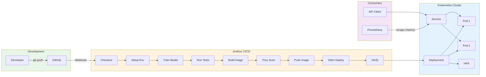
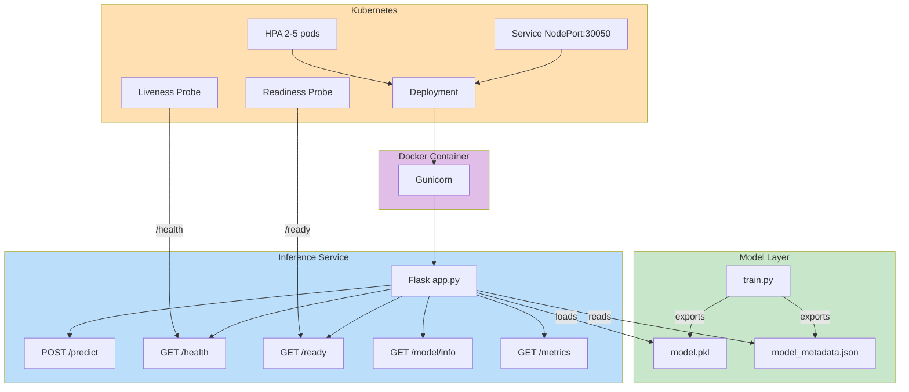

# Zero-Touch ML — Architecture

## System Overview

Zero-Touch ML implements a fully automated MLOps pipeline. The system orchestrates the journey from a developer's `git push` through model training, testing, containerization, security scanning, and deployment to a Kubernetes cluster — all without manual intervention.

---

## Pipeline Flow

---

## Component Architecture

---

## Key Design Decisions

### 1. Multi-Stage Docker Build
The Dockerfile uses a two-stage build to keep the production image small. The builder stage installs Python dependencies, and the production stage copies only the installed packages — no compilers or build tools in the final image.

### 2. Non-Root Container
The container runs as a dedicated `mluser` user, following the principle of least privilege. This prevents container escape exploits from gaining root access to the host.

### 3. Rolling Update Strategy
The Helm deployment uses `maxSurge: 1` and `maxUnavailable: 0`, ensuring that during an update, Kubernetes always maintains the desired number of running pods before terminating old ones. This achieves zero-downtime deployments.

### 4. Liveness vs Readiness Probes
- **Liveness** (`/health`): Always returns 200 if the Flask process is alive. Kubernetes restarts the container if this fails.
- **Readiness** (`/ready`): Returns 200 only if the ML model is loaded. Kubernetes removes the pod from the Service endpoint if this fails, preventing traffic to un-ready pods.

### 5. Model Versioning
Each training run generates a `model_metadata.json` with the model version, git SHA, accuracy, timestamp, and feature schema. This creates an audit trail and enables model lineage tracking.

### 6. Prometheus Metrics
The `/metrics` endpoint exposes:
- `inference_requests_total` — counter by endpoint, method, status
- `inference_request_duration_seconds` — latency histogram by endpoint
- `predictions_total` — counter by predicted class

Pod annotations enable automatic Prometheus scraping without additional configuration.

### 7. HorizontalPodAutoscaler
The HPA monitors CPU utilization and scales between 2 and 5 replicas. This ensures the inference API handles traffic spikes without manual intervention. Requires `metrics-server` addon in Minikube.

### 8. Dual CI Approach
- **Jenkins**: Full 9-stage pipeline (train → test → build → scan → deploy). Runs on merge to main.
- **GitHub Actions**: Lightweight lint + test. Runs on every PR for fast feedback.
